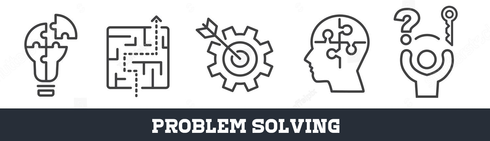
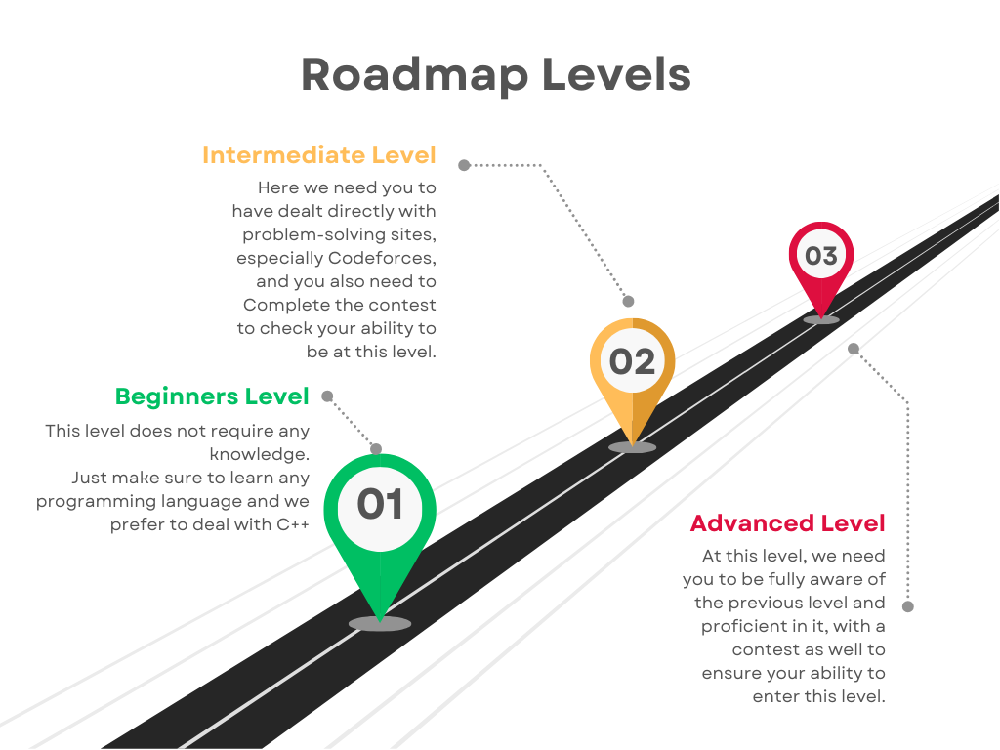

     

## Roadmap Levels:

     

🔗👻 [Beginner](#beginner) 
🔗🐱‍🏍 [Intermediate](#intermediate) 
🔗🕵️‍♂️ [Advanced](#advanced)

 

## 👻Beginner

> في المستوي ده مش هنحتاج منك كتير يا بطل كل المطلوب انك تكون بتعرف تكتب كود بس بأي لغة برمجة بس انا افضل لغة C++ عشان بنسبة 99.9999% هحطلك مصادر ل ناس بتطبق ب C++😁 بس طبعا احنا بنشرح فكرة و تقدر تطبقها بأي لغة.
> مفيش مصادر محددة للمستوي ده لانه هيكون سيشنز مع بعض و في الاغلب هتكون مسجلة بإذن الله فلو اتسجلت هرفع لينك الفيديوهات بتاعتها متقلقش و هتلاقي  المحتوي الي هنقوله في المستوي ده تحت

- Intro to Problem Solving
  
- Condition & Loops
  
- Arrays & string
  
- Complexity Analysis & Built-in Functions
  

## 🐱‍🏍Intermediate

- STL part 1: [video 1 Muhammad Magdi](http://youtube.com/watch?v=Uh2hnrjO26o) && [video 2 Muhammad Magdi](https://www.youtube.com/watch?v=JdP77eojCpU)

- STL part 2: [video 1 Muhammad Magdi](https://www.youtube.com/watch?v=u6WuKiOfLJo) && [video 2 Muhammad Magdi](https://www.youtube.com/watch?v=3sqOmhtH5SA&t=3s)
  
- Adhocs : [video 1 from ICPC Mansoura to 1h 29m 09s](https://youtu.be/i4A7HG4bGic?si=Kzu5xBzXqrnOESIP&t=780) && [frequency Array with EOI](https://www.youtube.com/watch?v=Y_LiOgx4KCM) or [frequency Array with Mahmoud Khalid](https://www.youtube.com/watch?v=xW_0Eay0XZE) or [frequency Array with Adel Nasim](https://youtu.be/73dAQba23-I?si=97WW-zIZt7V-1u9L)

- Two Pointers & Sliding Window : [ICPC Mansoura](https://youtu.be/i4A7HG4bGic?si=KAo1sco4VrTdtJ1t&t=5350)

- Binary Search : [ICPC Mansoura](https://youtu.be/v_i9VfvoQV4?si=NlG0gZU-J-G7WG_O)

- Recursion & Backtracking :
  - [Functions](https://www.youtube.com/watch?v=6m-RTOsvp7E&list=PLBkwGJXcrCATmqJ-xKYBtZIoMTVpHz6p7&pp=iAQB)
  - [Recursion](https://www.youtube.com/watch?v=t0cHKEof1S8&list=PLBkwGJXcrCATvPBkCUoJzURlO3MIeHZji&pp=iAQB)
  - [Bactracking](https://www.youtube.com/watch?v=lmhlsBwRKGo&list=PLBkwGJXcrCAS-s51m2n1ed_xbyqI_cEio&pp=iAQB)

## 🕵️‍♂️Advanced

### Part 1

- Bitmasks  & Iterative Complete Search : [video 1 Muhammad Magdi](https://youtu.be/Q4RA5N8xhh8?si=wMtsJVrbYLfYdpc4) && [video 2 Muhammad Magdi](https://youtu.be/t3W-zCx1OJ8?si=B6akOYcxSFt7q5QW) or [Mahmoud Ayman ](https://www.youtube.com/watch?v=M90Vj7-6Qwo)

- Number Theory part 1 : [Muhammad Magdi](https://youtu.be/heRWrCIQFzQ?si=UQihQvGr58TFO_U1)

- Number Theory part 2 : [Muhammad Magdi](https://youtu.be/j-7GfALqr-A?si=Cf4a1WwrzNaAlKrN)

### Part 2

- Intro to Graphs : [Muhammad Magdi](https://youtu.be/pU5PDOmM1cw?si=-awZ8kc0w0MYjfTv)

- DFS : [Muhammad Magdi](https://youtu.be/iJOB2lo39n0?si=IqB76GrCpHd5jwAC)

- BFS : [ICPC Mansoura](https://youtu.be/AuGNPvbfy4A?si=pi4guJAUKYJ-z9Bj) or [Muhammad Magdi](https://youtu.be/iJOB2lo39n0?si=IqB76GrCpHd5jwAC)

- Dynamic Programming recursive [ICPC Mansoura](https://youtu.be/gZoIkvSpHHg?si=78ai64ZezMm7dHkP)

- Dynamic Programming Iterative [ICPC Mansoura](https://youtu.be/w9aKOzbZrDk?si=8mMErKv1UbjcnZ11)

<h2>
🧏‍♂️ Let's Connect!
</h2>

   &nbsp;&nbsp;&nbsp;&nbsp;
   &nbsp;&nbsp;&nbsp;&nbsp;
   &nbsp;&nbsp;&nbsp;&nbsp;

