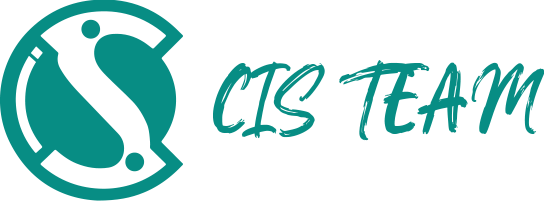

# **2024-2025 Roadmaps!**  
🚀 **Your go-to resource for detailed roadmaps to mastering popular technical tracks!**  

This repository contains detailed, step-by-step roadmaps for essential technical tracks. Each roadmap is designed to help you navigate your learning journey, from beginner to advanced levels, by covering the core concepts, tools, and skills needed to excel in each field.  

## **Included Tracks:**  
1. [**Backend Development**](https://github.com/CIS-Team/2024-2025-Roadmaps/tree/main/Backend)  
2. [**Frontend Development**](https://github.com/CIS-Team/2024-2025-Roadmaps/tree/main/Frontend)  
3. [**UI/UX Design**](https://github.com/CIS-Team/2024-2025-Roadmaps/tree/main/UI-UX)  
4. [**Flutter Development**](https://github.com/CIS-Team/2024-2025-Roadmaps/tree/main/Flutter)  
5. [**Embedded Systems**](https://github.com/CIS-Team/2024-2025-Roadmaps/tree/main/Embedded%20Systems)  
6. [**Data Science & Machine Learning**](https://github.com/CIS-Team/2024-2025-Roadmaps/tree/main/Data%20Science%20%26%20ML)  
7. [**Cybersecurity**](https://github.com/CIS-Team/2024-2025-Roadmaps/tree/main/Cyber%20Sceurity)  
8. [**Game Development**](https://github.com/CIS-Team/2024-2025-Roadmaps/tree/main/Game%20Development)  
9. [**Product Management**](https://github.com/CIS-Team/2024-2025-Roadmaps/tree/main/Product%20Management)  
10. [**Computer Science Fundamentals**](https://github.com/CIS-Team/2024-2025-Roadmaps/tree/main/computer%20science)  
11. [**Problem Solving**](https://github.com/CIS-Team/2024-2025-Roadmaps/tree/main/Problem%20Solving)
12. [**3D (Blender)**](https://github.com/CIS-Team/2024-2025-Roadmaps/tree/main/3D%20(Blender))
13. [**Graphic design**](https://github.com/CIS-Team/2024-2025-Roadmaps/tree/main/Graphic%20design)
14. [**Motion Graphics**](https://github.com/CIS-Team/2024-2025-Roadmaps/tree/main/Motion%20Graphics)
15. [**Video editing**](https://github.com/CIS-Team/2024-2025-Roadmaps/tree/main/Video%20editing)

## **Features:**  
- 📚 Recommended resources (books, tutorials, and courses).  
- 🛠️ Tools and technologies to learn for each track.  
- 💡 Tips on building projects.  
- 🌐 Insights into industry practices and career paths.  

Whether you're a student, a career switcher, or a professional looking to upskill, these roadmaps will guide you on your journey to success!  

---

💻 **Start your journey today and level up your tech skills!**

